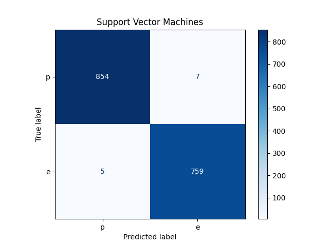
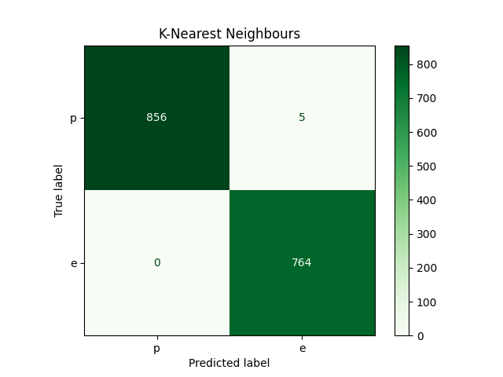

# Discussion

**Mushroom Dataset**

The mushroom dataset includes descriptions of hypotheticalsamples of 23 dierent species
of mushrooms. Each species is identified as either **edible** or **poisonous** ; poisonous ones
include those whose edibility is unknown.

The dataset has 23 all categorical attributes and8,124 instances, it, therefore, has enough
samples to conveniently train and test the modelsherein.

The Mushroom records are drawn fromThe Audubon SocietyField Guide to North American
Mushrooms(1981). G. H. Linco (Pres.), New York:Alfred A. Knopf and the dataset can be
sourced from **UCI** ,[Here](http://archive.ics.uci.edu/ml/datasets/Mushroom?ref=datanews.io).

**Model Selection**

Among the machine learning models provided for bythe **Scikit Learn** Library, I used
**Support Vector Machines** and **K-Nearest Neighbours** forthis particular classification.

I considered **SVM** because it usually works best withonly two classes, in this case,
poisonous(p) and edible(e). It also has one of thesimplest decision boundaries making it
immune to issues of overfitting.

**KNN** is a non-parametric technique; to mean that itsmodel structure is determined from the
data. This is a significant factor in this classificationproblem since we have 22 features
whose in-depth knowledge we don’t know.

**Model Performance**

According to our trained instances, KNN performedbest with an **accuracy score** of **100%** ;
on the other hand, the SVM had an **accuracy score** of **99.32%**.

The **confusion matrices** above show the number of predictedclasses which ended up in the
wring classification bins based on the true classes.KNN performed best with only a total of **5
wrong predictions** whereas SVM had a total of **12 wrongpredictions**.
